# Hello there, I'm Oğuzhan 👋

## I'm a student and a developer!

- 🌱 I’m currently learning Rust
- 👯 I’m looking to collaborate with other developers
- 🥅 Things I will make in 2023: QuizMile 👀
- ⚡ Fun fact: I love to play piano

### Languages and Tools:

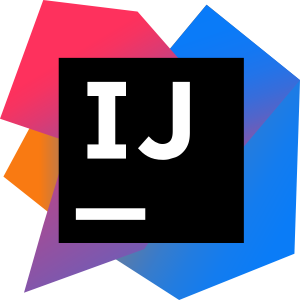 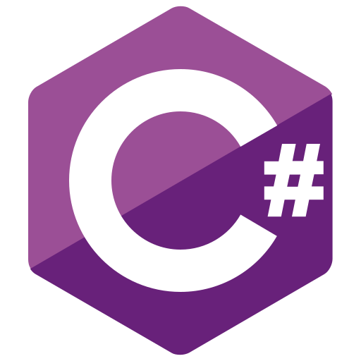

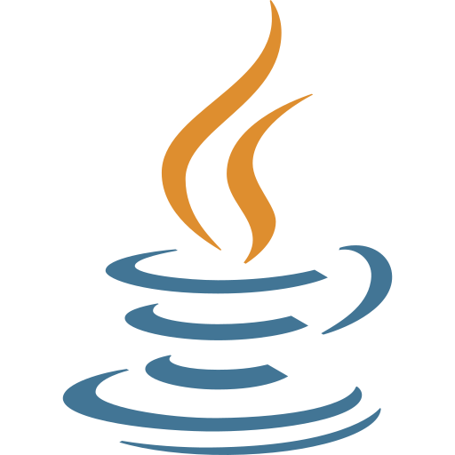

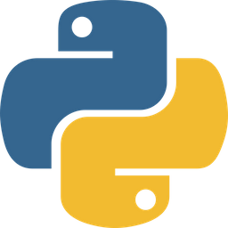

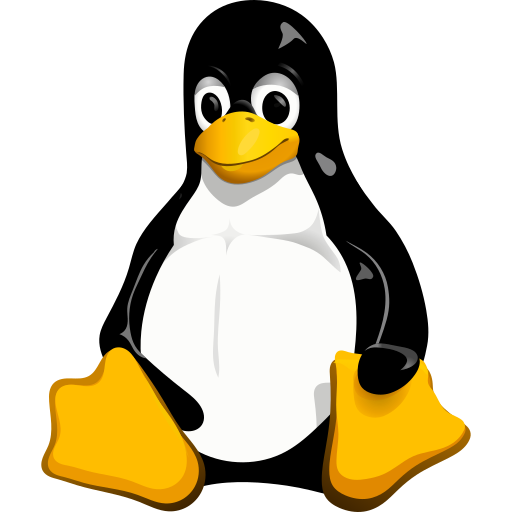
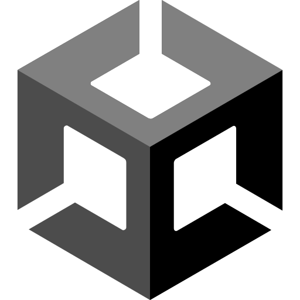

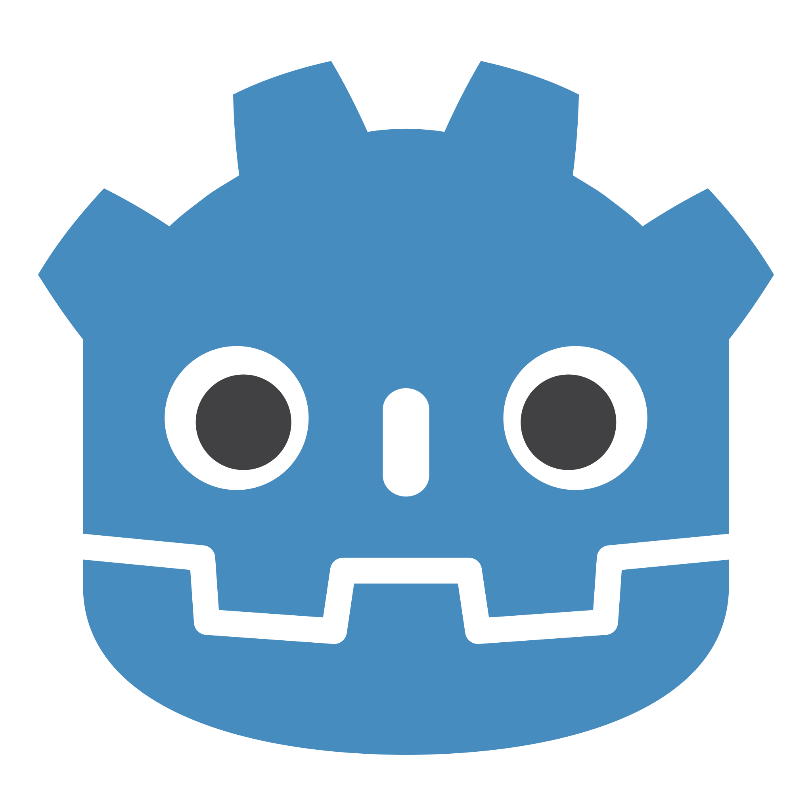
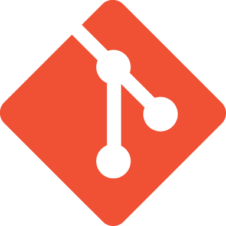

<a href="https://github.com/LightGameEngine/LightGameEngine">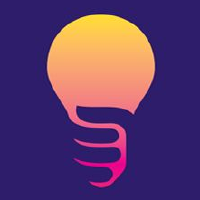</a>

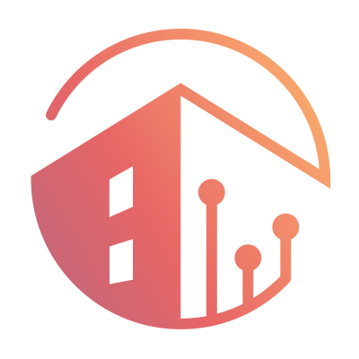
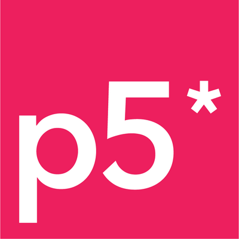

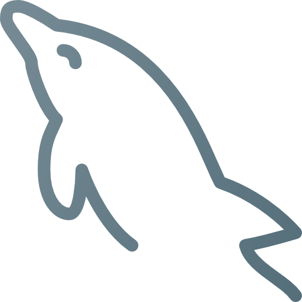
  

### *A fool is known by his speech; and a wise man by silence.*
\- Pythagoras

<!-- old :p Silence is better than unmeaning words. - Pythagoras -->

<!-- old :p
**You know when you're in love, you can't fall asleep...**

<i>Because reality is finally better than dreams...</i>
-->